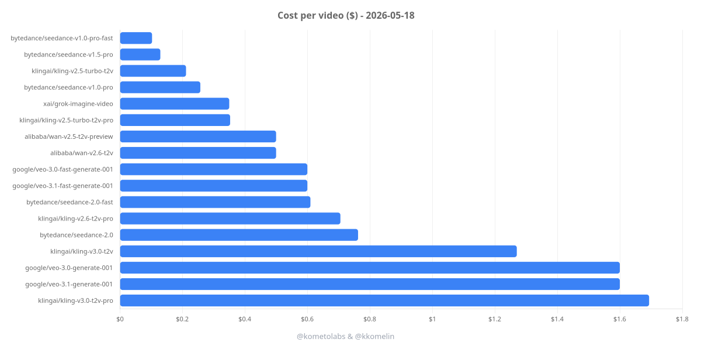
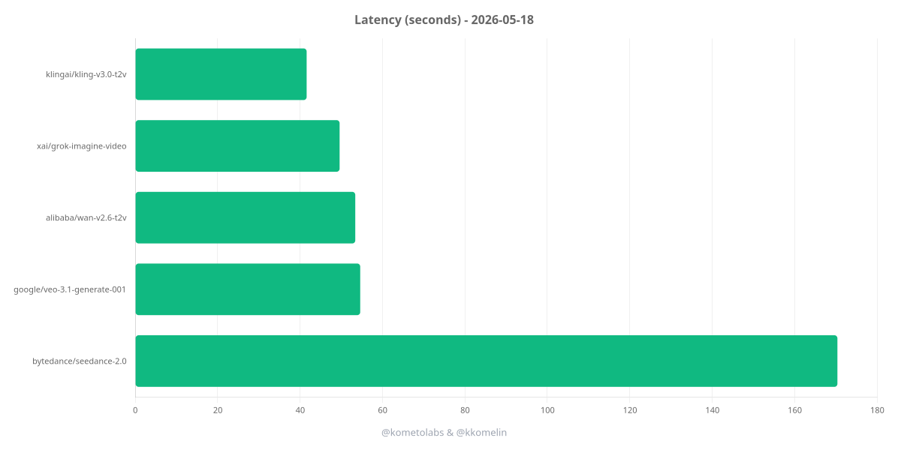

# AI Video Generation Cost Analysis

Benchmark text-to-video models behind Vercel AI Gateway, save the generated videos, and produce a Markdown report with cost and latency per model.

## Results

Latest run - see the full table with per-model videos in [results/report.md](./results/report.md).

[](./results/videos/charts/cost.png)

[](./results/videos/charts/latency.png)

## What It Does

- Runs multiple text-to-video models through a single CLI.
- Uses `experimental_generateVideo` from the Vercel AI SDK (v6).
- Saves generated `.mp4` files to `./results/videos`.
- Renders cost and latency bar charts to `./results/videos/charts`.
- Writes a Markdown report to `./results/report.md` with inline HTML5 `<video controls>` tags (GitHub renders them).
- Tracks provider-reported cost when available.

## Models Covered

Full list in [`src/models.ts`](./src/models.ts):

- `alibaba/wan-v2.6-t2v` - Alibaba Wan 2.6 (text-to-video)
- `bytedance/seedance-2.0` - ByteDance Seedance 2.0
- `google/veo-3.1-generate-001` - Google Veo 3.1
- `klingai/kling-v3.0-t2v` - KlingAI Kling 3.0 (text-to-video)
- `xai/grok-imagine-video` - xAI Grok Imagine Video

Provider-specific quirks and workarounds are documented in [MODEL-QUIRKS.md](./MODEL-QUIRKS.md).

## Requirements

- [Bun](https://bun.sh)

## Install

```bash
bun install
```

## Configure

### Create and add Vercel AI Gateway API Key

Create an API key at https://vercel.com/d?to=/[team]/~/ai-gateway/api-keys

```bash
cp .env.example .env
```

Set the `AI_GATEWAY_API_KEY` environment variable in `.env`:

```bash
export AI_GATEWAY_API_KEY=your_key_here
```

### Configure benchmark

Edit [src/config.ts](./src/config.ts) to change:

- the benchmark prompt
- aspect ratio
- resolution
- duration in seconds
- request delay
- output paths

Edit [src/models.ts](./src/models.ts) to enable or disable models or adjust model-specific overrides (`aspectRatio`, `resolution`, `duration`, `providerOptions`, `skipResolution`, `skipAspectRatio`).

## Run

```bash
bun start
```

> Each video generation call can take 1-10+ minutes. The benchmark uses a custom gateway in [`src/gateway.ts`](./src/gateway.ts) with an extended 15-minute Undici `Agent` timeout to keep long fetches alive. Expect a full run to cost a few USD - check provider pricing before running.

> Models are called sequentially with a deliberate 65-second delay between requests (`delayBetweenRequestsMs` in [src/config.ts](./src/config.ts)). KlingAI on the Vercel AI Gateway enforces a 1 request/minute quota for accounts with balances below $100 - waiting > 60s between calls keeps multi-model runs from tripping that quota. See [MODEL-QUIRKS.md](./MODEL-QUIRKS.md) for details.

## Output

The CLI prints progress for each model and runs three phases:

1. **Generation** - calls each enabled model and saves outputs to `./results/videos/`.
2. **Report** - writes `./results/report.md` with a comparison table containing:
   - model ID
   - cost (gateway-reported when available)
   - latency (wall-clock seconds, measured by the client)
   - inline `<video controls>` tag pointing to the saved `.mp4`
3. **Charts** - renders cost and latency bar charts to `./results/videos/charts/{cost.png, latency.png}`.

## Notes

- The runner uses `result.videos[i].uint8Array` to save bytes to disk; `mediaType` provides the file extension (`.mp4` for all current models).
- Cost metadata comes from `result.providerMetadata?.gateway?.cost`.
- Per-provider parameter constraints (Veo `duration` in `{4,6,8}`, Kling rejecting `resolution`, Wan rejecting `aspectRatio`, etc.) are handled via per-model overrides in `src/models.ts`. See [MODEL-QUIRKS.md](./MODEL-QUIRKS.md) for the full list.
